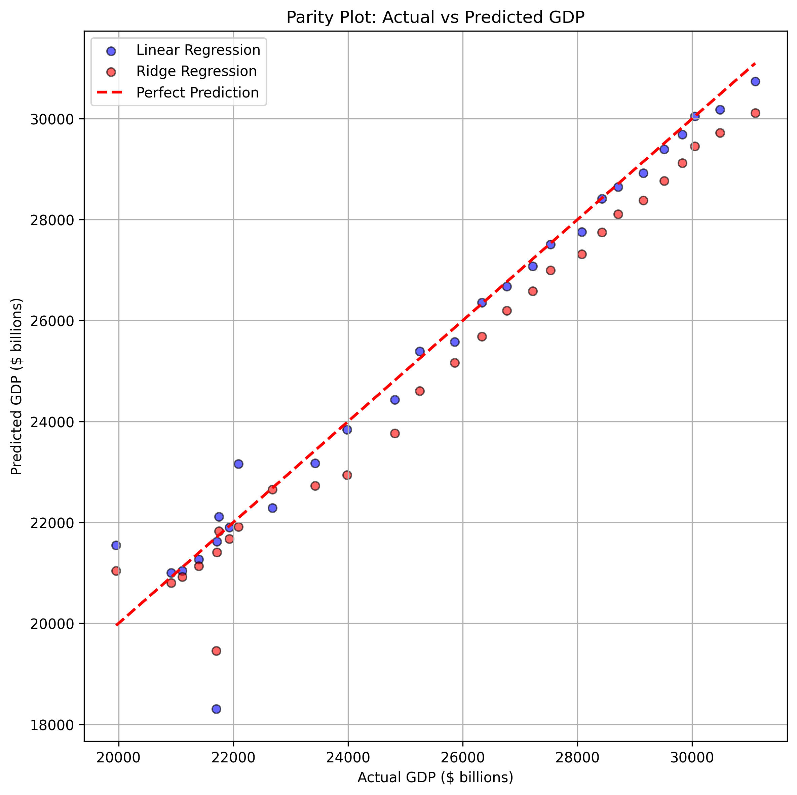
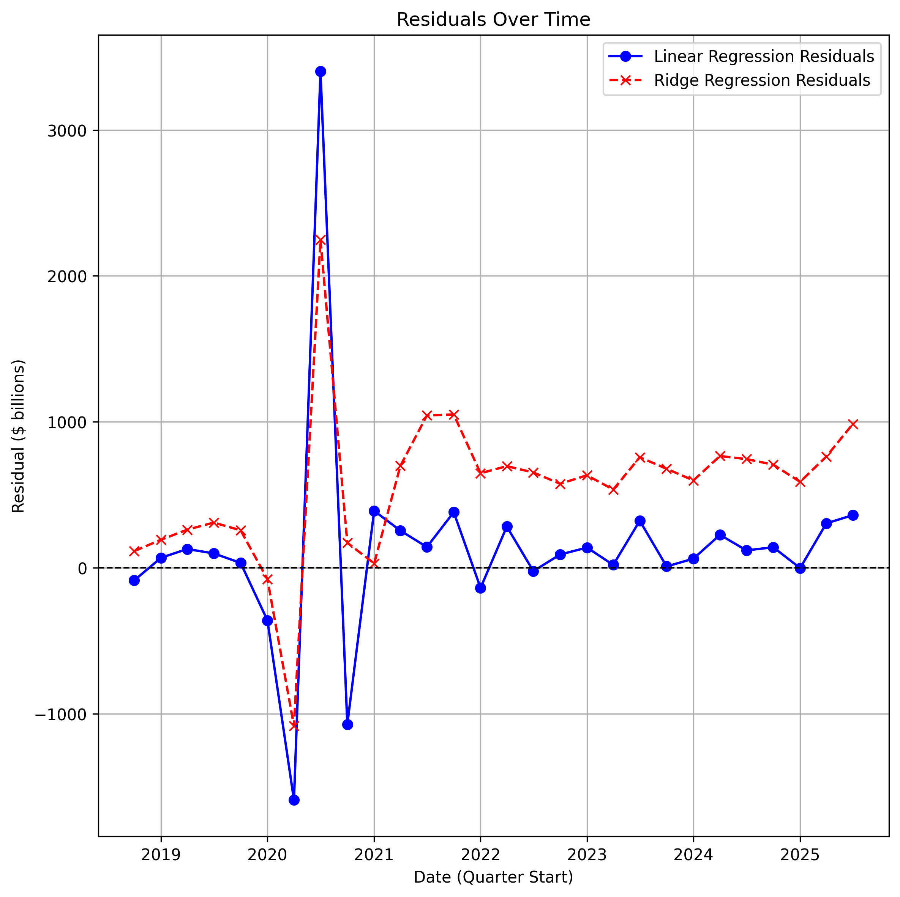
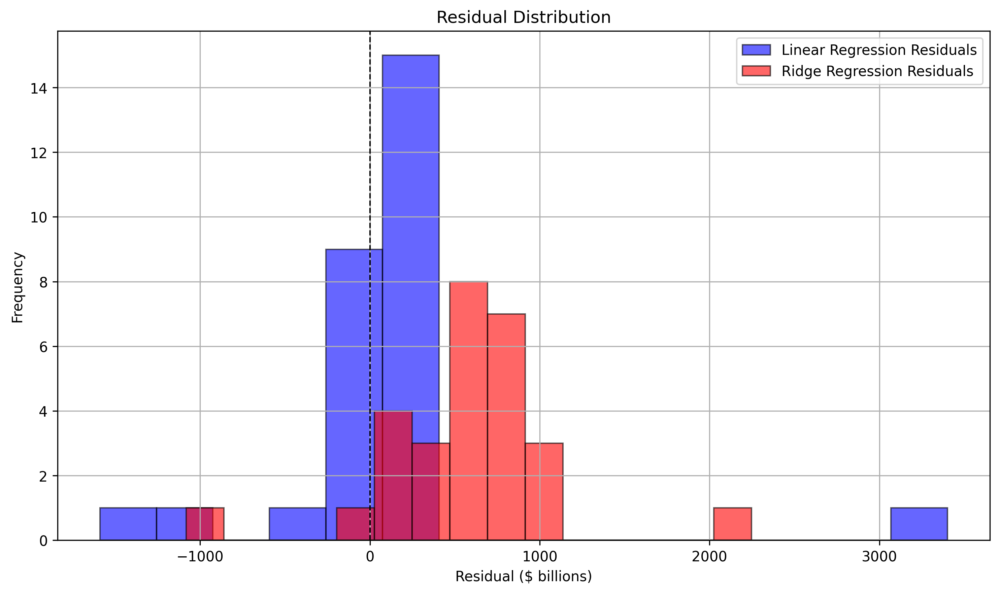

# GDP Prediction Pipeline
### Forecasting U.S. GDP using Linear Regression and Ridge Regression ML Pipelines

## Overview
This project builds an end-to-end regression pipeline using U.S. macroeconomic indicators from the Federal Reserve Economic Data (FRED) to predict quarterly GDP. The goal is to demonstrate **data ingestion, feature engineering, evaluation, and visualization** in an interpretable and reproducible way. 

## Data Source
- FRED (GDP, CPI, Unemployment Rate, Federal Funds Rate)

## Data Pipeline
* Loads raw CSVs from 'data/raw/'
* Aggregates monthly data to quarterly frequency
* Merges GDP, CPI, unemployment rate, and federal funds rate
* Creates additional features:
    * GDP growth
    * CPI percent change
    * Unemployment rate change
    * Lagged features for GDP, GDP growth, CPI, Unemployment Rate, and Federal Funds Rate
* Saves final processed DataFrame to 'data/processed/features.csv'

# Models

## Linear Regression
A baseline linear regression model is used to predict quarterly GDP using macroeconomic data as features.
* **Target variable**: GDP
* **Features**: lagged macroeconomic indicators
* **Training/testing split**: 80% / 20% (chronological split, no shuffling)
* **Evaluation Metrics**:
    * MAE - Mean Absolute Error
    * RMSE - Root Mean Squared Error
    * R<sup>2</sup> - Coefficient of Determination

### Model Performance:
- **MAE (Mean Absolute Error):** \$366.26 billion
    - (1.44% of average GDP)
- **RMSE (Root Mean Squared Error):** \$763.99 billion  
    - (3.01% of average GDP)
- **R<sup>2</sup> (Coefficient of Determination):** 0.95  
    - (95% of variance explained)
These results indicate that the linear regression model has relatively low average error and captures the majority of GDP variation. 

## Ridge Regression
Ridge regression extends linear regression by adding an L2 regularization penalty to reduce overfitting and increase resistance to noise.
* **Target variable**: GDP
* **Features**: lagged macroeconomic indicators
* **Training/testing split**: 80% / 20% (chronological split, no shuffling)
* **Evaluation Metrics**:
    * MAE - Mean Absolute Error
    * RMSE - Root Mean Squared Error
    * R<sup>2</sup> - Coefficient of Determination

### Model Performance:
- **MAE (Mean Absolute Error):** \$638.54 billion
    - (2.51% of average GDP)
- **RMSE (Root Mean Squared Error):** \$768.05 billion  
    - (3.02% of average GDP)
- **R<sup>2</sup> (Coefficient of Determination):** 0.95  
    - (95% of variance explained)
Similar to the previous model, the ridge regression model has relatively low average error and captures the majority of GDP variation. 

## Model Comparison
| Model | MAE | RMSE | R<sup>2</sup> |
|:------|:---:|-----:|---:|
| Linear Regression | $366.26B | $763.99B | 0.95 |
| Ridge Regression | $638.54B | $768.05B | 0.95 |
The models perform nearly identically in the RMSE and R<sup>2</sup> metrics. However, the Ridge model produces a significantly higher average error due to the L2 regularization shrinking the coefficients too aggressively.

## Model Visualization
The following figures are generated using Matplotlib to better interpret model behavior and error patterns:

* **Parity Plot:** Actual vs. Predicted GDP


* **Residuals Over Time:** Residuals vs. Time (quarters)


* **Residual Distribution:** Histogram of Residuals to interpret variance and error symmetry


All 3 plots are saved to the figures/ directory.

## How to use
1. Install libraries:
```bash
pip install -r requirements.txt
```

2. Run main.py to execute the full pipeline
```bash
python main.py
```

### Future Improvements
* Tune *alpha* for Ridge regression using **cross-validation**.
* Additional models (Lasso, tree-based models).
* Additional macroeconomic indicators and features.
